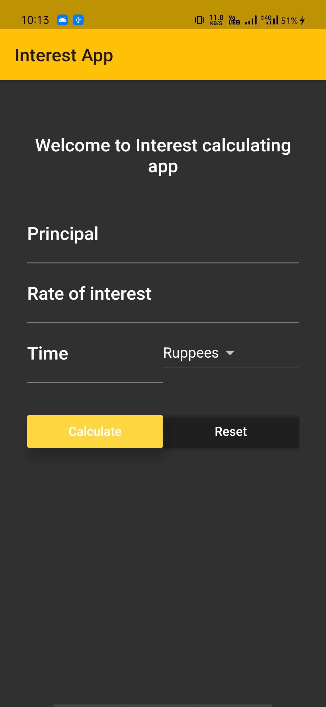

# interest_app

## Getting Started

This project is a starting point for a Flutter application.

A few resources to get you started if this is your first Flutter project:

- [Lab: Write your first Flutter app](https://flutter.dev/docs/get-started/codelab)
- [Cookbook: Useful Flutter samples](https://flutter.dev/docs/cookbook)

For help getting started with Flutter, view our
[online documentation](https://flutter.dev/docs), which offers tutorials,
samples, guidance on mobile development, and a full API reference.

## Screenshot

## Want to contribution ?
* We welcome everyone to contribute on this project
### To contribute
1. Fork this project
2. Clone onto your local computer
3. debug code or add features or anything you want to add
4. Send the pull request

## Developed by
Jaspreet Singh

### Get in touch
LinkedIn -https://www.linkedin.com/in/jaspreetsidhu13/  
GitHub - https://github.com/jaspreetsidhu3

## Note
* Before using this project delete screenshot folder as it may cause conflicts.
